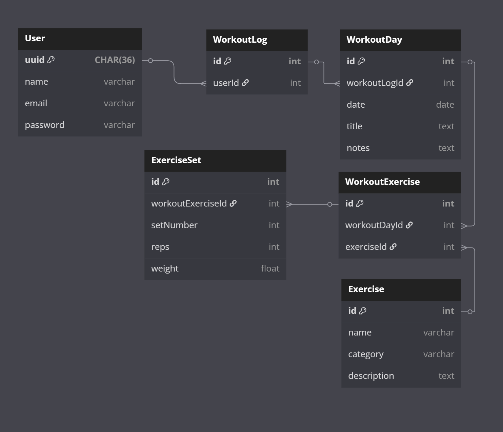

# ERD

### dbdriagram.io code

      Table User {
        uuid CHAR(36) pk
        name varchar
        email varchar [unique]
        password varchar
      }

      Table WorkoutLog {
        id int [pk, increment]
        userId int [ref: > User.uuid]
      }

      Table WorkoutDay {
        id int [pk, increment]
        workoutLogId int [ref: > WorkoutLog.id]
        date date
        title text
        notes text
      }

      Table Exercise {
        id int [pk, increment]
        name varchar
        category varchar
        description text
      }

      Table WorkoutExercise {
        id int [pk, increment]
        workoutDayId int [ref: > WorkoutDay.id]
        exerciseId int [ref: > Exercise.id]
      }

      Table ExerciseSet {
        id int [pk, increment]
        workoutExerciseId int [ref: > WorkoutExercise.id]
        setNumber int
        reps int
        weight float
      }

### SQL code (EERD)

      CREATE TABLE User (
        uuid CHAR(36) PRIMARY KEY,
        name VARCHAR(255),
        email VARCHAR(255) UNIQUE,
        password VARCHAR(255)
      );

      CREATE TABLE WorkoutLog (
        id INT AUTO_INCREMENT PRIMARY KEY,
        userId CHAR(36),
        FOREIGN KEY (userId) REFERENCES User(uuid)
      );

      CREATE TABLE WorkoutDay (
        id INT AUTO_INCREMENT PRIMARY KEY,
        workoutLogId INT,
        date DATE,
        title TEXT,
        notes TEXT,
        FOREIGN KEY (workoutLogId) REFERENCES WorkoutLog(id)
      );

      CREATE TABLE Exercise (
        id INT AUTO_INCREMENT PRIMARY KEY,
        name VARCHAR(255),
        category VARCHAR(255),
        description TEXT
      );

      CREATE TABLE WorkoutExercise (
        id INT AUTO_INCREMENT PRIMARY KEY,
        workoutDayId INT,
        exerciseId INT,
        FOREIGN KEY (workoutDayId) REFERENCES WorkoutDay(id),
        FOREIGN KEY (exerciseId) REFERENCES Exercise(id)
      );

      CREATE TABLE ExerciseSet (
        id INT AUTO_INCREMENT PRIMARY KEY,
        workoutExerciseId INT,
        setNumber INT,
        reps INT,
        weight FLOAT,
        FOREIGN KEY (workoutExerciseId) REFERENCES WorkoutExercise(id)
      );
