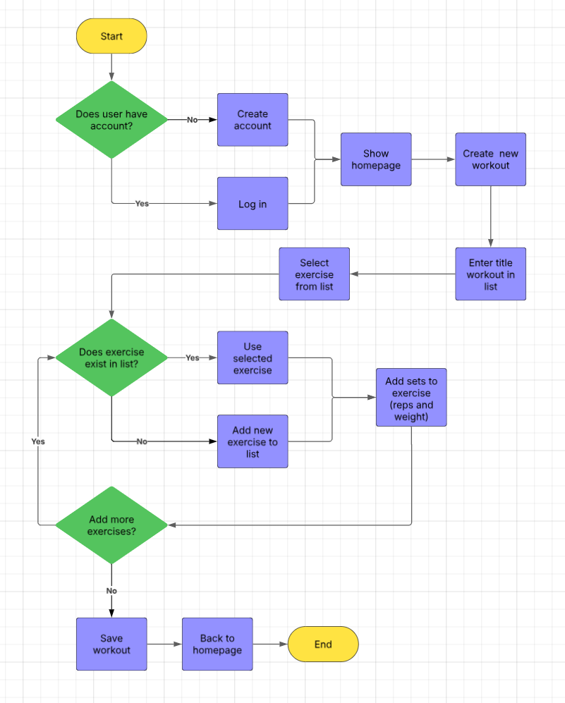

# Flowchart

This flowchart outlines the basic flow of actions a user takes to log a workout session in the application. It begins with the user logging in, followed by navigating through the workout creation process, selecting or adding exercises, inputting set details, and saving the session. The flow includes decision points (e.g., adding more exercises) and ends by returning the user to the dashboard. The diagram uses standard flowchart elements: terminators (start/end), processes (user/system actions), and decisions (yes/no logic branches).

- Terminator is yellow
- Proces is purple
- Decision is green
